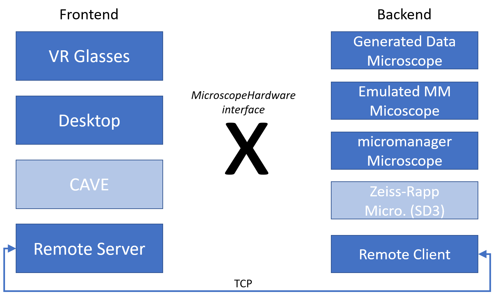
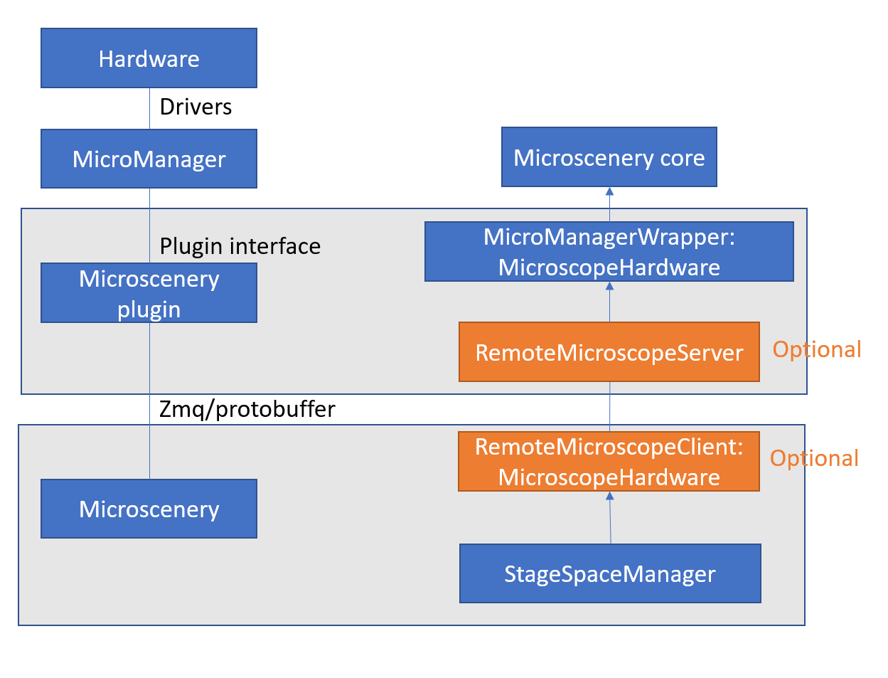

# Microscenery

## Running user studies
### Requirements
* JDK of Java 17 or higher installed
* SteamVR and a working VR headset set up
* up-to-date graphics drivers with Vulkan support

### Running studies

The study conditions
* `Study2DAxon`
* `Study2DTube`
* `Study3DAxon`
* `Study3DTube`
* `StudyVRAxon`
* `StudyVRTube`

can be run by invoking `./gradlew [study type]` on the command line, e.g. `./gradlew Study2DAxon`. Position data will be written as CSV to the `spatialLogs` directory, with each new study stored in a timestamped file.

## Components

## A Micromanager Setup

